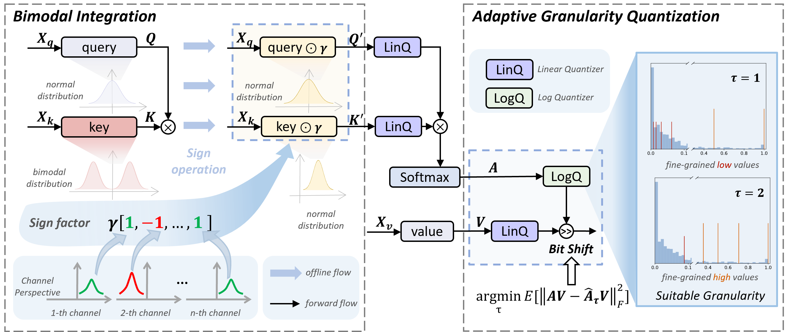

# PTQ4SAM: Post-Training Quantization for Segment Anything (CVPR 2024)

[Chengtao Lv*](https://scholar.google.com/citations?user=r8vseSUAAAAJ&hl=en), [Hong Chen*](https://scholar.google.com/citations?user=Gw16nzQAAAAJ&hl=en&oi=sra), [Jinyang Guo📧](https://scholar.google.com/citations?user=uJGeT1AAAAAJ&hl=en&oi=sra), [Yifu Ding](https://scholar.google.com/citations?user=RCEI1r0AAAAJ&hl=en&oi=sra), [Xianglong Liu](https://scholar.google.com/citations?user=8VY7ZDcAAAAJ&hl=en&oi=ao)

(* denotes equal contribution, 📧 denotes corresponding author.)

## Overview

Segment Anything Model (SAM) has achieved impressive performance in many computer vision tasks. However, as a large-scale model, the immense memory and computation costs hinder its practical deployment. In this paper, we propose a post-training quantization (PTQ) framework for Segment Anything Model, namely [PTQ4SAM](https://arxiv.org/pdf/2405.03144). First, we investigate the inherent bottleneck of SAM quantization attributed to the bimodal distribution in post-Key-Linear activations. We analyze its characteristics from both per-tensor and per-channel perspectives, and propose a Bimodal Integration strategy, which utilizes a mathematically equivalent sign operation to transform the bimodal distribution into a relatively easy-quantized normal distribution offline. Second, SAM encompasses diverse attention mechanisms (i.e., self-attention and two-way cross-attention), resulting in substantial variations in the post-Softmax distributions. Therefore, we introduce an Adaptive Granularity Quantization for Softmax through searching the optimal power-of-two base, which is hardware-friendly.


## Create Environment
🍺🍺🍺 You can refer the ``environment.sh`` in the root directory or install step by step.
1. Install PyTorch
```
conda create -n ptq4sam python=3.7 -y
pip install torch torchvision
```

2. Install MMCV

```
pip install -U openmim
mim install "mmcv-full<2.0.0"
```

3. Install other requirements

```
pip install -r requirements.txt
```

4. Compile CUDA operators

```
cd projects/instance_segment_anything/ops
python setup.py build install
cd ../../..
```

5. Install mmdet
```
cd mmdetection/
python3 setup.py build develop
cd ..
```

## Prepare Dataset and Models
Download the official COCO dataset, put them into the corresponding folders of `datasets/` and recollect them as the following form:

```shell
├── data
│   ├── coco
│   │   ├── annotations
│   │   ├── train2017
│   │   ├── val2017
│   │   ├── test2017
```

Download the pretrain weights (SAM and detectors), put them into the corresponding folders of `ckpt/`:

- `sam_b`: [ViT-B SAM](https://dl.fbaipublicfiles.com/segment_anything/sam_vit_b_01ec64.pth)
- `sam_l`: [ViT-L SAM](https://dl.fbaipublicfiles.com/segment_anything/sam_vit_l_0b3195.pth)
- `sam_h`: [ViT-H SAM](https://dl.fbaipublicfiles.com/segment_anything/sam_vit_h_4b8939.pth)
- `faster rcnn`: [R-50-FPN Faster R-CNN](https://download.openxlab.org.cn/models/mmdetection/FasterR-CNN/weight/faster-rcnn_r50_fpn_2x_coco)
- `yolox`: [YOLOX-l](https://download.openmmlab.com/mmdetection/v2.0/yolox/yolox_l_8x8_300e_coco/yolox_l_8x8_300e_coco_20211126_140236-d3bd2b23.pth)
- `detr`: [H-Deformable-DETR](https://github.com/HDETR/H-Deformable-DETR/releases/download/v0.1/r50_hybrid_branch_lambda1_group6_t1500_dp0_mqs_lft_deformable_detr_plus_iterative_bbox_refinement_plus_plus_two_stage_36eps.pth)
- `dino`: [DINO](https://projects4jw.blob.core.windows.net/focalnet/release/detection/focalnet_large_fl4_o365_finetuned_on_coco.pth)

## Usage
To perform quantization on models, specify the model configuration and quantization configuration. For example, to perform W6A6 quantization for SAM-B with a YOLO detector, use the following command:
```shell
python ptq4sam/solver/test_quant.py \ 
--config ./projects/configs/yolox/yolo_l-sam-vit-l.py \
--q_config exp/config66.yaml --quant-encoder
```
- yolo_l-sam-vit-l.py: configuration file for the SAM-B model with YOLO detector.
- config66.yaml: configuration file for W6A6 quantization.
- quant-encoder: quant the encoder of SAM.


We recommend using a GPU with more than 40GB for experiments.
If you want to visualize the prediction results, you can achieve this by specifying `--show-dir`.
Bimodal distributions mainly occur in the `mask decoder` of SAM-B and SAM-L.

## Reference
If you find this repo useful for your research, please consider citing the paper.
```
@inproceedings{lv2024ptq4sam,
  title={PTQ4SAM: Post-Training Quantization for Segment Anything},
  author={Lv, Chengtao and Chen, Hong and Guo, Jinyang and Ding, Yifu and Liu, Xianglong},
  booktitle={Proceedings of the IEEE/CVF Conference on Computer Vision and Pattern Recognition},
  pages={15941--15951},
  year={2024}
}
```


## Acknowledgments
The code of PTQ4SAM was based on [Prompt-Segment-Anything](https://github.com/RockeyCoss/Prompt-Segment-Anything) and [QDrop](https://github.com/wimh966/QDrop). We thank for their open-sourced code.
